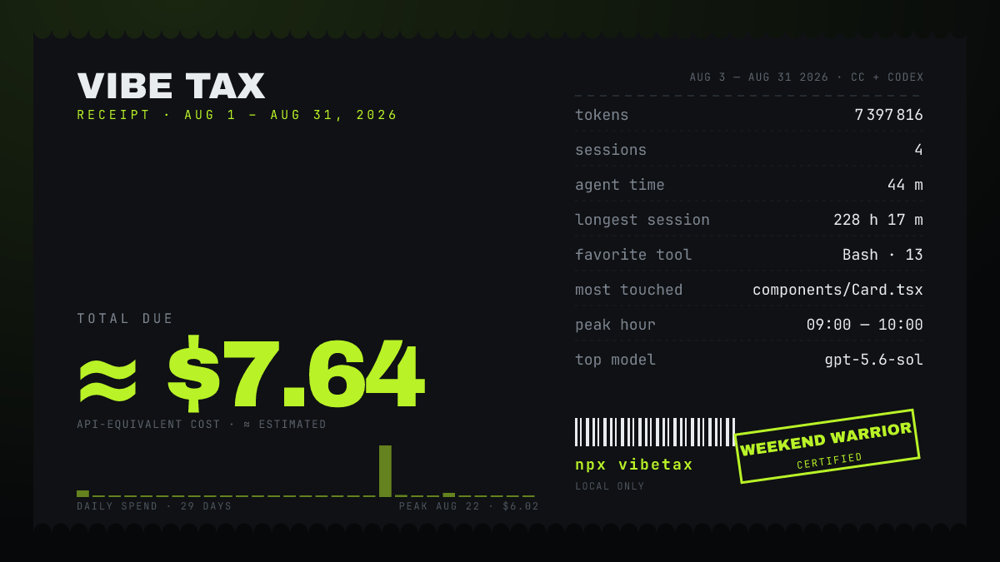
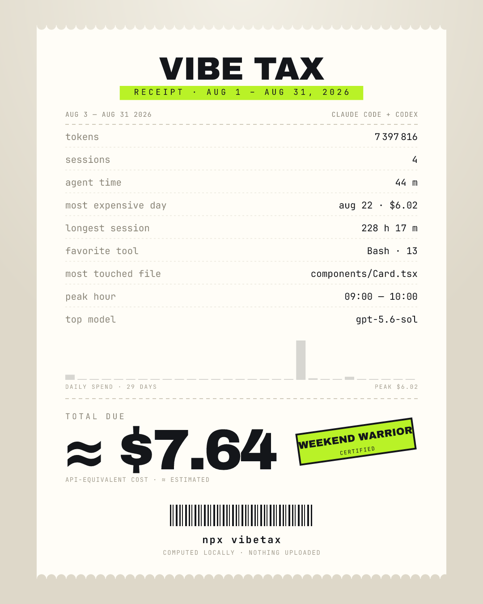

# vibetax

[](https://github.com/TinyFrontier/vibetax/actions/workflows/ci.yml) [](https://www.npmjs.com/package/vibetax)

**Everything runs on your machine. vibetax makes no network requests: no uploads, no telemetry, no version checks.**

> What's your vibe tax this month?

`npx vibetax` reads the logs that Claude Code and Codex CLI already keep locally and turns them into a receipt you can post: what your coding agents would have cost at API prices, how many tokens they burned, your most expensive day, your favorite tool, your peak hour.


## Run it

```bash
npx vibetax
```

That is the whole workflow. No install, no login, no questions:

```
vibetax · scanning ~/.claude and ~/.codex …
found 214 sessions (Claude Code: 187, Codex: 27) · Jun 1 – Sep 3 2026

┌─────────────────────────────────────────────┐
│  YOUR VIBE TAX · last 30 days               │
│                                             │
│  $412.80 vibe tax   48.2M tokens            │
│  214 sessions       61 h 12 m of agent time │
│                                             │
│  Most expensive day    Aug 14 · $38.10      │
│  Longest session       4 h 07 m             │
│  Favorite tool         Edit (2,341 calls)   │
│  Most touched file     src/api/router.ts    │
│  Peak hour             23:00–00:00          │
│  Top model             claude-opus-5        │
│                                             │
│  API-equivalent cost                        │
│                                npx vibetax  │
└─────────────────────────────────────────────┘

  ✓ saved ./vibetax-2026-09-03.png (1200×675)
  share it: https://x.com/intent/post?text=…
```

The PNG is 1200×675 (right for X):



`--portrait` gives 1080×1350 for Instagram and LinkedIn, `--theme light` swaps the palette:



## Options

```
vibetax [options]

  --period <p>        7d | 30d | 90d | ytd | all | 2026-06-01..2026-08-31   (default: 30d)
  --agent <a>         claude | codex | all                                    (default: all)
  --out <path>        where to write the PNG                                  (default: ./vibetax-<date>.png)
  --portrait          1080×1350 instead of 1200×675
  --theme <t>         dark | light                                            (default: dark)
  --no-image          terminal card only
  --open              open the PNG when done
  --json              print every metric to stdout as JSON
  --anonymize         hide file names ("Most touched file" becomes "a .ts file")
  --pricing <file>    your own price list (same shape as pricing.json)
  --claude-dir <dir>  Claude Code config dir                                  (default: $CLAUDE_CONFIG_DIR or ~/.claude)
  --codex-dir <dir>   Codex home                                              (default: $CODEX_HOME or ~/.codex)
```

`Nd` means N calendar days including today. `A..B` is inclusive on both ends, in your local time zone.

## What it reads, what it does not

Reads:

- `~/.claude/projects/**/*.jsonl`: from each `assistant` record only the timestamp, model, token usage, session id, working directory and the name of each tool call plus the file path it touched.
- `~/.codex/sessions/**/*.jsonl` and `~/.codex/archived_sessions/*.jsonl`: session metadata, the model per turn, token counts, tool call names and the paths in `apply_patch` results.
- `~/.codex/config.toml`: only the `model` key, as a fallback when a log has no model.

Does not read:

- Your prompts, the assistant's replies, tool outputs, file contents, shell commands. Those lines are skipped before they are parsed.
- Anything outside those directories.

On the card and in `--json` you get aggregates, model names, and one file shown as `folder/name.ext`. Full paths never leave the metrics. `--anonymize` hides that file too. Sharing is a pre-filled `x.com/intent/post` link; you attach the image yourself.

## How the money is computed

The number is the **API-equivalent cost**: what the same tokens would have cost on the public API price lists. If you are on a Claude Max or Pro plan, or ChatGPT Plus for Codex, that is the bill you did not pay.

- Prices per model live in [pricing.json](pricing.json) (USD per 1M tokens), fetched from the Anthropic and OpenAI pricing pages on 2026-09-03. Override with `--pricing`.
- Model names match by exact id or by a dated suffix (`claude-opus-4-1-20250805` → `claude-opus-4-1`). An unknown model falls back to its family (`opus`, `sonnet`, `haiku`, `gpt-5.6`, `gpt-5`, …) and the card says `≈ estimated`. A model with no family at all is priced at $0 and reported as a warning.
- Claude prompt-cache writes come in two kinds, 5-minute (1.25× input) and 1-hour (2× input). The logs carry the split and vibetax prices each at its own rate. On the same price list the totals match `ccusage` to the dollar.
- Codex `cached_input_tokens` are a subset of `input_tokens`; vibetax separates them so cached context is billed at the cached rate.
- Codex "guardian" review threads are counted in the cost but not in the session count. Their logs carry the label `codex-auto-review` instead of a model, so they are priced as the default model with the `≈ estimated` mark.

## What the metrics mean

| Metric | Definition |
|---|---|
| Agent time | Sum of gaps between consecutive API calls inside a session; a gap longer than 30 minutes counts as zero |
| Longest session | Last call minus first call, no pause cut. A tab left open overnight will show here |
| Most expensive day, peak hour | In your local time zone |
| Favorite tool | Most frequent tool call name |
| Most touched file | Most frequent path in Edit/Write/Read calls and Codex patches, shown as `folder/name` |
| Top model | Highest total cost |
| Stamp | Night Owl ≥ 45 % of calls between 22:00 and 05:00; Early Bird ≥ 25 % between 05:00 and 09:00; Weekend Warrior ≥ 40 % on weekends; Marathoner ≥ 50 calls per session on average; Sprinter ≤ 12; otherwise no stamp |

Duplicate log records are removed before counting: Claude Code writes one line per content block with the same usage repeated, and occasionally replays a line. Without that step the token counts would be roughly double.

## Supported agents

- Claude Code, including subagent logs.
- Codex CLI (0.100 and newer; older versions did not log token counts).

Cursor, Gemini CLI, OpenCode and Aider are on the list. Each one is a single function that turns its logs into sessions, so pull requests are welcome.

## Development

```bash
npm install
npm test          # vitest: parsers against anonymized real-log fixtures, metrics, card, CLI
npm run build     # tsc → dist/
node dist/cli.js --claude-dir test/fixtures/claude --codex-dir test/fixtures/codex --period 2026-08-01..2026-08-31
```

Fixtures under `test/fixtures/` mirror `~/.claude` and `~/.codex` and were generated from real logs through a field whitelist, with every text replaced by `<redacted>`. `expected.json` next to each set holds the ground truth computed independently with jq.

## License

MIT. Bundled fonts: [JetBrains Mono](https://github.com/JetBrains/JetBrainsMono) and [Archivo Black](https://github.com/google/fonts/tree/main/ofl/archivoblack), both under the SIL Open Font License (see `fonts/`).
